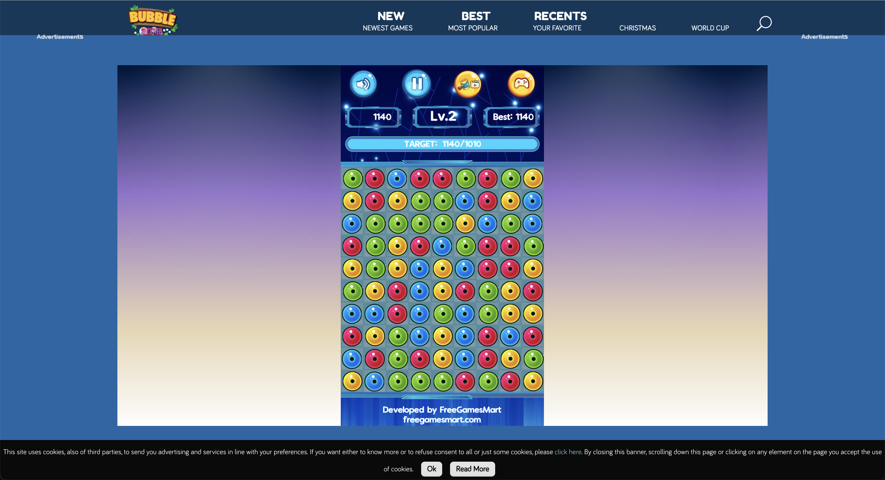
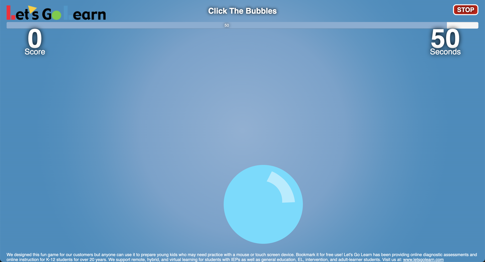

# 9103 Final Individual
### Instructions for Interaction

In the individual part of this assignment, I created the following three animated interactive designs based on the group code:
• Press the space bar to switch between the white and black parts of the background.
• When the mouse moves over a pattern, the pattern enlarges. When the mouse moves away, the pattern returns to its normal size.
• When the mouse clicks on a pattern, the pattern disappears from the screen. Press the Reset button to restore all patterns.
### Animation Approach & Driver

I chose keyboard and mouse input as the method for animating the images. First, I analysed the elements in the image and designed three types of animation interactions: pressing the space bar to switch between black and white backgrounds, clicking on a pattern to make it disappear, and moving the mouse over a corresponding pattern to enlarge it. Compared to the animations used by other members, which were triggered by time or music, my animation emphasises the user's sense of active control and experience.
### Inspiration

<<<<<<< HEAD

[Click Bubbles](https://bubble-shooter.co/click-bubbles)

=======

[Click Bubbles](https://bubble-shooter.co/click-bubbles)

>>>>>>> 86624db19e9b51cb1338a7e956a6e7cba2416248
[Let's Go Learn: Bubbles](https://frontend.letsgolearn.com/practice/bubbles#)

In my design, I referenced two web games: Click Bubbles and Let's Go Learn: Bubbles. I drew inspiration from the design where, after the user clicks on a small ball, it immediately disappears. I applied this concept to my design. When the user clicks on a circular pattern, the pattern immediately disappears. This design provides users with a clean, clear, and timely feedback experience.
### Technical explanation

In terms of the technical aspects of the code implementation, I improved on the group code. Firstly, I unified the data such as the position and size of each pattern by storing it into an array. By looping over the images and drawing them, this improvement can better facilitate the control of each pattern in the subsequent interaction design. In the keyboard interaction I created a variable to record the current state and then used translate() and rotate() to swap the black background with the white background when the spacebar is pressed. In the mouse hover interaction, I detect the distance between the mouse position and the centre of the circle, and add scale() and translate() to Push() to make the graphic bigger when the user moves the mouse over an icon, and back to normal size when the mouse is removed. In the mouse click interaction, I created a boolean array to record the display state of each pattern, and used this array to implement the function that the pattern disappears when the user clicks on it. Finally, in order to allow the user to restore the original artwork for viewing I added a Reset button to reset all the patterns on the canvas.
In the implementation of these functions, I refer to the p5.js related techniques described in the course and the official documentation of p5.js using mousePressed(), mouseMoved(), keyPressed() to achieve the effects of the functions I have implemented.
